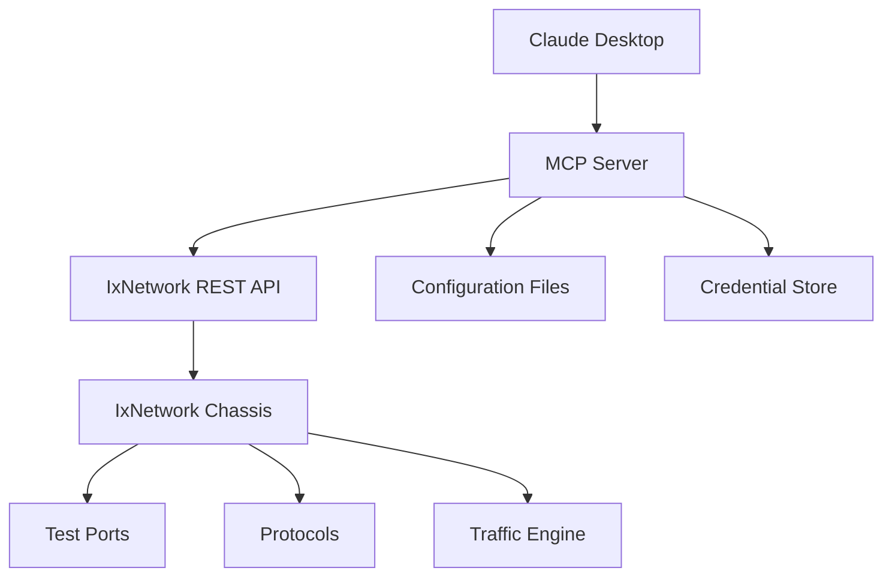

# 🌐 IxNetwork MCP Server

[](https://www.python.org/)
[](https://modelcontextprotocol.io/)
[](https://www.keysight.com/find/ixnetwork)
[](LICENSE)

> **Model Context Protocol (MCP) Server for IxNetwork Test Automation** 🚀

A powerful MCP server that enables natural language interaction with IxNetwork test equipment through Claude Desktop. Manage network testing sessions, protocols, and traffic generation using simple English commands.

## ✨ Features

- 🔧 **Session Management**: Create, view, and delete IxNetwork sessions
- 📁 **Configuration Loading**: Load IxNetwork configuration files (.ixncfg)
- 🔌 **Port Management**: Connect and manage test ports
-  **Protocol Control**: Start/stop network protocols (BGP, OSPF, etc.)
- 📊 **Traffic Generation**: Control traffic flows and monitor statistics
- 🔐 **Credential Management**: Secure credential storage and management
- 📈 **Real-time Statistics**: Monitor test results and performance metrics
- 🛡️ **Error Handling**: Comprehensive error handling and logging

## ️ Architecture



## 🛠️ Tech Stack

| Component | Technology | Version |
|-----------|------------|---------|
| **Language** |  | 3.13+ |
| **MCP Framework** |  | 1.6.0+ |
| **IxNetwork API** |  | 1.6.1+ |
| **HTTP Client** |  | 0.28.1+ |
| **Package Manager** |  | Latest |
| **Web Scraping** |  | 4.0+ |

## 🚀 Quick Start

### Prerequisites

- Python 3.13 or higher
- IxNetwork chassis with REST API access
- Claude Desktop application

### Installation

1. **Clone the repository**
   ```bash
   git clone https://github.com/yourusername/ixnetwork-mcp.git
   cd ixnetwork-mcp
   ```

2. **Install dependencies using UV**
   ```bash
   uv sync
   ```

3. **Configure IxNetwork credentials**
   ```bash
   # Edit the configuration file
   nano ixnetwork_config.json
   ```

4. **Configure Claude Desktop MCP**
   
   Create `~/Library/Application Support/Claude/claude_desktop_mcp_config.json`:
   ```json
   {
     "mcpServers": {
       "ixnetwork-session-manager": {
         "command": "python",
         "args": ["/path/to/ixnetwork-mcp/server.py"],
         "cwd": "/path/to/ixnetwork-mcp"
       }
     }
   }
   ```

5. **Restart Claude Desktop**

##  Configuration

### IxNetwork Configuration

Edit `ixnetwork_config.json` to add your chassis credentials:

```json
{
  "10.36.236.121": {
    "username": "admin",
    "password": "your_password"
  },
  "10.36.237.131": {
    "username": "admin", 
    "password": "your_password"
  }
}
```

### Configuration Files

Place your IxNetwork configuration files in the `ixia_configuration_files/` directory:

```
ixia_configuration_files/
├── bgp_ngpf.ixncfg
├── ospf_test.ixncfg
└── traffic_profile.ixncfg
```

## 🎯 Usage Examples

### Session Management
```
"Create a new IxNetwork session on chassis 10.36.236.121"
"List all sessions on the chassis"
"Delete session with ID 12345"
```

### Configuration Loading
```
"Load the BGP configuration file into session 12345"
"Connect ports [10.36.236.121, 1, 1] to the session"
```

### Protocol Control
```
"Start all protocols in session 12345"
"Stop all protocols in session 12345"
```

### Traffic Management
```
"Start traffic in session 12345"
"Get traffic statistics for session 12345"
"Stop all traffic in session 12345"
```

### System Operations
```
"Test connection to chassis 10.36.236.121"
"Show current configuration"
"Update credentials for IP 10.36.236.121"
```

##  Available Tools

| Tool | Description | Parameters |
|------|-------------|------------|
| `get_sessions` | List all sessions on chassis | `api_server_ip` |
| `create_session` | Create new session | `api_server_ip`, `session_name` |
| `delete_ixnetwork_session` | Delete session | `api_server_ip`, `session_id` |
| `load_ixnetwork_config` | Load configuration file | `api_server_ip`, `session_id`, `ixia_config_file` |
| `connect_ports` | Connect ports to session | `api_server_ip`, `session_id`, `port_list` |
| `start_protocols` | Start all protocols | `api_server_ip`, `session_id` |
| `stop_protocols` | Stop all protocols | `api_server_ip`, `session_id` |
| `start_traffic` | Start traffic generation | `api_server_ip`, `session_id`, `traffic_item_name` |
| `stop_traffic` | Stop traffic generation | `api_server_ip`, `session_id` |
| `get_traffic_stats` | Get traffic statistics | `api_server_ip`, `session_id`, `statistics_name` |
| `test_connection` | Test chassis connection | `api_server_ip` |
| `update_credentials` | Update credentials | `ip_address`, `username`, `password` |
| `get_current_configuration` | Show current config | None |

## 📁 Project Structure

```
ixnetwork-mcp/
├── 📄 server.py                    # Main MCP server implementation
├── 📄 pyproject.toml              # Project dependencies and metadata
├── 📄 uv.lock                     # Locked dependency versions
├── 📄 ixnetwork_config.json       # IxNetwork credentials configuration
├── 📄 .python-version             # Python version specification
├── 📄 .gitignore                  # Git ignore rules
├──  ixia_configuration_files/   # IxNetwork configuration files
│   └── 📄 bgp_ngpf.ixncfg         # BGP test configuration
├── 📁 .venv/                      # Virtual environment
└── 📄 README.md                   # This file
```

## 🔍 Troubleshooting

### Common Issues

1. **Connection Failed**
   - Verify chassis IP address and credentials
   - Check network connectivity
   - Ensure REST API is enabled on chassis

2. **MCP Server Not Starting**
   - Verify Python 3.13+ is installed
   - Check all dependencies are installed: `uv sync`
   - Review Claude Desktop MCP configuration

3. **Permission Errors**
   - Ensure proper file permissions
   - Check working directory in MCP configuration

### Debug Mode

Enable debug logging by modifying the logging level in `server.py`:

```python
logging.basicConfig(level=logging.DEBUG, ...)
```

## 🤝 Contributing

1. Fork the repository
2. Create a feature branch: `git checkout -b feature/amazing-feature`
3. Commit your changes: `git commit -m 'Add amazing feature'`
4. Push to the branch: `git push origin feature/amazing-feature`
5. Open a Pull Request

## 📄 License

This project is licensed under the MIT License - see the [LICENSE](LICENSE) file for details.

##  Acknowledgments

- [Model Context Protocol](https://modelcontextprotocol.io/) for the MCP framework
- [Keysight IxNetwork](https://www.keysight.com/find/ixnetwork) for the test platform
- [Claude Desktop](https://claude.ai/) for the AI interface

## 📞 Support

-  **Email**: support@yourcompany.com
- 🐛 **Issues**: [GitHub Issues](https://github.com/yourusername/ixnetwork-mcp/issues)
-  **Documentation**: [Wiki](https://github.com/yourusername/ixnetwork-mcp/wiki)

---

<div align="center">

**Made with ❤️ for Network Testing Automation**

[](https://github.com/yourusername/ixnetwork-mcp)
[](https://github.com/yourusername/ixnetwork-mcp)

</div>
